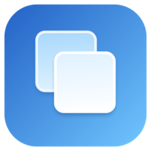

<div align="center">
  <div>
    
  </div>

  <div>
    <h1>
      Copio
    </h1>
  </div>
</div>

**A fast, private clipboard history for macOS.**

Copio lives in the menu bar and brings your recent copies back with a keyboard shortcut. It is a native macOS app built with Swift, SwiftUI, and AppKit. Your clipboard history stays on your Mac; Copio has no account, backend, or telemetry. Update checks contact GitHub.

## Features

- **Quick Search:** Press **⌘⇧V** to open a centered search panel over your current app, or click the menu bar icon.
- **Useful filters:** Browse Recent, Favorites, Images, URLs, Passwords, Folders, Files, and Code. Narrow results by source app, time, collection, or favorite status.
- **Collections and favorites:** Keep frequently used items easy to find.
- **Image and file support:** See image thumbnails and file names. Copio uses an image's available title or URL filename when it can, and lets you rename an image.
- **Sensitive content controls:** Detected secrets require a choice before storage. Saved passwords are masked in search and stored in the macOS Keychain; optional Mac authentication protects access.
- **Local controls:** Set history limits, remove old items automatically, exclude apps, and export or import regular clipboard history.
- **Updates:** See the current version in Settings, check for updates manually, or let Copio check, download, and install signed updates from GitHub Releases automatically.

## Requirements

- macOS 14 or later
- Apple Silicon or Intel Mac
- Xcode Command Line Tools and Swift 6 to build from source

## Build and install

From the repository root:

```sh
./scripts/build-app.sh
open dist/Copio.app
```

The build creates `dist/Copio.app`. To install it locally, drag **Copio.app** into **Applications**. Copio is a menu bar app, so it does not keep a Dock icon. On first launch it shows a short setup screen and then opens Quick Search; later, use **⌘⇧V** or the menu bar icon.

To make a local drag-and-drop disk image:

```sh
./scripts/package-dmg.sh
./scripts/package-zip.sh
```

Open the DMG and drag **Copio** onto **Applications**. The ZIP is an alternative archive of the same universal app. Release files are ad hoc signed and are **not notarized** because this project does not use an Apple Developer ID certificate. On first launch, macOS may block the app. If you trust this download, try opening Copio once, then go to **System Settings → Privacy & Security → Open Anyway** and confirm. Do not disable Gatekeeper system-wide. See [Apple's instructions](https://support.apple.com/guide/mac-help/open-a-mac-app-from-an-unknown-developer-mh40616/mac).

## Updates and GitHub releases

**Settings → General** shows the installed version and a **Check for Updates…** button. Copio uses [Sparkle](https://sparkle-project.org/) to check the latest release of `Bes-js/Copio` on GitHub. Automatic checks and automatic installation can be switched off in Settings. Until the repository has a public release with an `appcast.xml` asset, Copio will report that no update is available to install.

For each public release:

1. Increase both `CFBundleShortVersionString` and `CFBundleVersion` in `Sources/Copio/Resources/Info.plist`. The build number must increase for Sparkle to recognize an update.
2. Build the universal app with `./scripts/build-app.sh`. The script ad hoc signs the app; no Apple Developer ID certificate is needed.
3. Package the app as `Copio-X.Y.Z.dmg` in an otherwise empty release directory. For example: `./scripts/package-dmg.sh dist/release-v1.1.0/Copio-1.1.0.dmg`.
4. Run `./scripts/generate-appcast.sh dist/release-v1.1.0 v1.1.0`. This signs the update archive using the private Sparkle key saved in this Mac's Keychain under `Bes-js-Copio`. Generate the appcast **before** adding the ZIP to the release directory.
5. Run `./scripts/package-zip.sh dist/release-v1.1.0/Copio-1.1.0.zip` to offer a ZIP download too.
6. Create a GitHub Release tagged `v1.1.0` and upload `Copio-1.1.0.dmg`, `Copio-1.1.0.zip`, and `appcast.xml` as assets. Use the matching version and tag for later releases.

Keep the Sparkle private key out of the repository and back it up securely. The app contains only its public verification key. The update feed is `https://github.com/Bes-js/Copio/releases/latest/download/appcast.xml`. Sparkle archive signatures protect updates; they do not replace Apple's Developer ID signature or notarization. Until a newer release exists, the update installation path cannot be tested end to end.

## Keyboard shortcuts

| Shortcut | Action                                                |
| -------- | ----------------------------------------------------- |
| ⌘⇧V      | Open or close Quick Search (customizable in Settings) |
| ↑ / ↓    | Move through results                                  |
| Return   | Copy selected item                                    |
| ⌘Return  | Copy and paste selected item                          |
| ⌘D       | Add or remove selected item from Favorites            |
| ⌘K       | Add selected item to a collection                     |
| ⌘Delete  | Delete selected item                                  |
| Escape   | Close Quick Search                                    |

Automatic paste needs Accessibility access, which can be opened from **Settings → Shortcuts**. Copying an item does not need that access. Notifications are optional.

## Privacy and data

Copio stores regular history and collections locally. Existing installations continue using `~/Library/Application Support/ClipCollections/` so the rename does not discard previous items. Saved password values are stored separately in this Mac's Keychain. History exports include regular items and their stored image or rich-text assets, but exclude Keychain secrets. Automatic update checks make HTTPS requests to GitHub; copied content is never included in them.

Source-app attribution is best effort: macOS does not always identify the app behind a background copy. Sensitive-content detection is also heuristic. Copied files are stored as references to their original paths, so moving or deleting the original files can make those entries unavailable.

## Development

Run the smoke checks with:

```sh
./scripts/smoke-test.sh
```

They cover clipboard classification and capture, search and filters, persistence, collections, image thumbnails, and a synthetic Keychain round trip. The checks use temporary data and a private test pasteboard.

The app icon can be regenerated with `./scripts/generate-icon.sh`.
